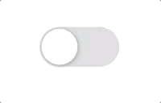
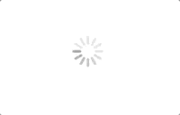
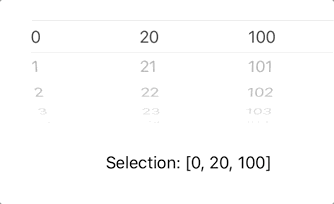
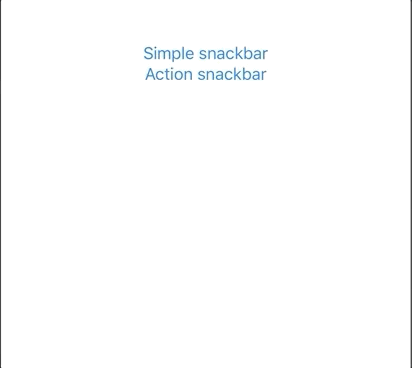
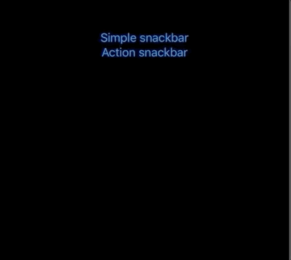

# Swift-UI-Views

A collection of custom views to reuse in SwiftUI projects


## Table of Contents

- [Switch](#switch) 
- [Activity Indicator](#activity-indicator)
- [Picker](#picker)
- [Snackbar](#snackbar)

## Views

### Switch

Works on: `iOS`, `macOS`, `watchOS`.

 

```swift
struct CustomSwitch: View {

    @Binding var isOn: Bool

    var body: some View {
        ZStack {
            Capsule()
                .foregroundColor(isOn ? Color.green : Color.gray.opacity(0.35))
                .background(Color.clear)
                .frame(width: 100, height: 50)
            Circle()
                .foregroundColor(Color.white)
                .frame(width: 45, height: 45)
                .offset(x: isOn ? 25 : -25, y: 0)
                .shadow(color: .gray, radius: 3, x: 1, y: 1)
        }
        .tapAction {
            withAnimation {
                self.isOn.toggle()
            }
        }
    }

}
```

### Activity Indicator

Works on: `iOS`.



```swift
struct ActivityIndicator: UIViewRepresentable {

    @Binding var isAnimating: Bool
    let style: UIActivityIndicatorView.Style

    func makeUIView(context: UIViewRepresentableContext<ActivityIndicator>) -> UIActivityIndicatorView {
        UIActivityIndicatorView(style: style)
    }

    func updateUIView(_ uiView: UIActivityIndicatorView,
                      context: UIViewRepresentableContext<ActivityIndicator>) {
        isAnimating ?
            uiView.startAnimating() :
            uiView.stopAnimating()
    }
}
```

### Picker

Works on: `iOS`.



```swift
struct CustomPicker<Data>: UIViewRepresentable where Data: Equatable {

    @Binding var data: [[Data]]
    @Binding var selection: [Data]

    class Coordinator: NSObject, UIPickerViewDelegate, UIPickerViewDataSource {

        @Binding var data: [[Data]]
        @Binding var selection: [Data]

        init(data: Binding<[[Data]]>, selection: Binding<[Data]>) {
            $data = data
            $selection = selection
        }

        func pickerView(_ pickerView: UIPickerView,
                        numberOfRowsInComponent component: Int) -> Int {
            data[component].count
        }

        func numberOfComponents(in pickerView: UIPickerView) -> Int {
            data.count
        }

        func pickerView(_ pickerView: UIPickerView,
                        widthForComponent component: Int) -> CGFloat {
            return (pickerView.superview?.bounds.width ?? 0) * 0.33
        }

        func pickerView(_ pickerView: UIPickerView,
                        rowHeightForComponent component: Int) -> CGFloat {
            return 30
        }

        func pickerView(_ pickerView: UIPickerView,
                        viewForRow row: Int,
                        forComponent component: Int,
                        reusing view: UIView?) -> UIView {
            guard let reusableView = view as? UILabel else {
                let label = UILabel(frame: .zero)
                label.text = "\(data[component][row])"
                return label
            }
            reusableView.text = "\(data[component][row])"
            return reusableView
        }

        func pickerView(_ pickerView: UIPickerView,
                        didSelectRow row: Int,
                        inComponent component: Int) {
            let value = data[component][row]
            selection[component] = value
        }
    }

    func makeCoordinator() -> CustomPicker.Coordinator {
        return Coordinator(data: $data,
                           selection: $selection)
    }

    func makeUIView(context: UIViewRepresentableContext<CustomPicker>) -> UIPickerView {
        let picker = UIPickerView()
        picker.delegate = context.coordinator
        return picker
    }

    func updateUIView(_ uiView: UIPickerView,
                      context: UIViewRepresentableContext<CustomPicker>) {

        uiView.reloadAllComponents()
        DispatchQueue.main.asyncAfter(deadline: .now() + 0.1) {
            self.selection.enumerated().forEach { tuple in
                let (offset, value) = tuple
                let row = self.data[offset].firstIndex { $0 == value } ?? 0
                uiView.selectRow(row, inComponent: offset, animated: false)
            }
        }

    }

}
```

**Demo:**

```swift
struct ContentView: View {

    @State var data: [[Int]] = [
        Array(0...10),
        Array(20...40),
        Array(100...200)
    ]
    @State var selection: [Int] = [0, 20, 100]

    var body: some View {
        NavigationView {
            VStack {
                CustomPicker(data: self.$data,
                             selection: self.$selection)
                Text("Selection: \(String(describing: selection))")
            }
        }
    }

}
```

### Snackbar

Works on `iOS`




```swift
struct Snackbar: View {

    @Binding var isShowing: Bool
    private let presenting: AnyView
    private let text: Text
    private let actionText: Text?
    private let action: (() -> Void)?

    private var isBeingDismissedByAction: Bool {
        actionText != nil && action != nil
    }

    @Environment(\.colorScheme) private var colorScheme: ColorScheme

    init<Presenting>(isShowing: Binding<Bool>,
         presenting: Presenting,
         text: Text,
         actionText: Text? = nil,
         action: (() -> Void)? = nil) where Presenting: View {

        $isShowing = isShowing
        self.presenting = AnyView(presenting)
        self.text = text
        self.actionText = actionText
        self.action = action

    }

    var body: some View {
        GeometryReader { geometry in
            ZStack(alignment: .center) {
                self.presenting
                VStack {
                    Spacer()
                    if self.isShowing {
                        HStack {
                            self.text
                                .color(self.colorScheme == .light ? .white : .black)
                            Spacer()
                            if (self.actionText != nil && self.action != nil) {
                                self.actionText!
                                    .bold()
                                    .color(self.colorScheme == .light ? .white : .black)
                                    .tapAction {
                                        self.action?()
                                        withAnimation {
                                            self.isShowing = false
                                        }
                                    }
                            }
                        }
                        .padding()
                        .frame(width: geometry.size.width * 0.9, height: 50)
                        .shadow(radius: 3)
                        .background(self.colorScheme == .light ? Color.black : Color.white)
                        .offset(x: 0, y: -20)
                        .transition(.asymmetric(insertion: .move(edge: .bottom),                                           removal: .move(edge: .trailing)))
                        .animation(Animation.spring())
                        .onAppear {
                            guard !self.isBeingDismissedByAction else { return }
                            DispatchQueue.main.asyncAfter(deadline: .now() + 2) {
                                withAnimation {
                                    self.isShowing = false
                                }
                            }
                        }
                    }
                }
            }
        }
    }

}
```

**View extension:**

```swift
extension View {

    func snackBar(isShowing: Binding<Bool>,
                  text: Text,
                  actionText: Text? = nil,
                  action: (() -> Void)? = nil) -> some View {

        Snackbar(isShowing: isShowing,
                 presenting: self,
                 text: text,
                 actionText: actionText,
                 action: action)

    }

}
```

**Demo:**

```swift
struct ContentView : View {

    @State var showSnackBar = false
    @State var showActionSnackBar = false

    var body: some View {
        NavigationView {
            VStack {
                Button(action: {
                    withAnimation {
                        self.showSnackBar.toggle()
                    }
                }) {
                    Text("Simple snackbar")
                }
                Button(action: {
                    withAnimation {
                        self.showActionSnackBar.toggle()
                    }
                }) {
                    Text("Action snackbar")
                }
            }
        }
        .snackBar(isShowing: $showSnackBar,
                  text: Text("Hello Snackbar!"))
        .snackBar(isShowing: $showActionSnackBar,
                    text: Text("Hello Snackbar!"),
                    actionText: Text("YEAH!"),
                    action: {})
    }

}
```
